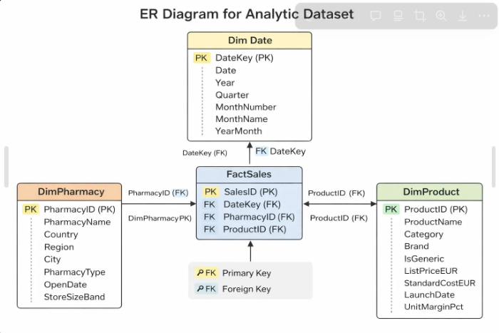
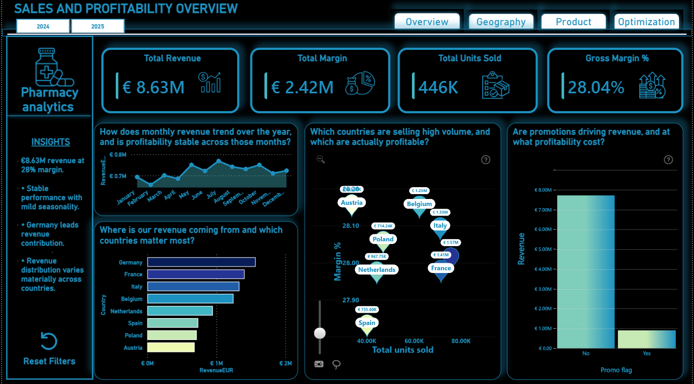
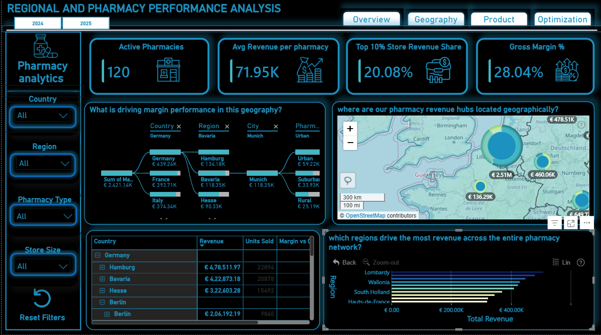
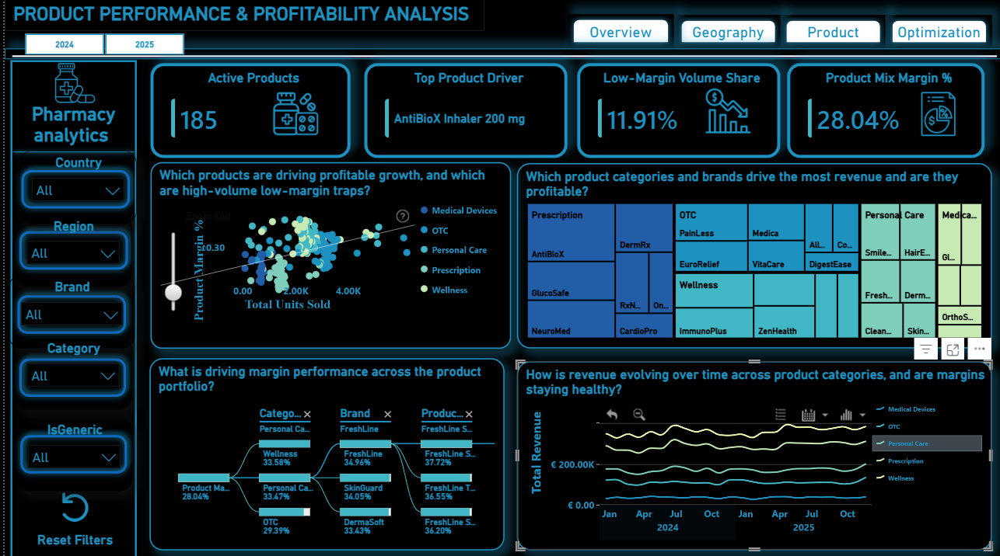
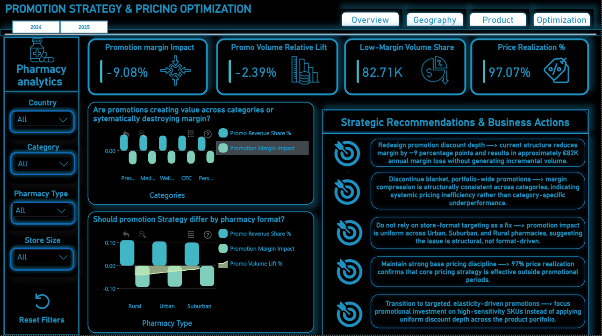

# 🏥 Pharmacy Sales & Profitability Analytics

> **Power BI · Dimensional Modeling · KPI Engineering · Promotion Optimization**

---

## Executive Summary

This project analyzes daily transaction-level data from a European pharmacy distributor operating across **8 countries** to evaluate revenue growth, profitability drivers, geographic performance, and promotion effectiveness.

The core objective was to design an **interactive, decision-ready Power BI dashboard** that enables stakeholders to:

- Monitor overall financial health
- Diagnose geographic performance differences
- Identify high-volume but low-margin risks
- Benchmark pharmacy productivity
- Evaluate whether promotions are creating or destroying value

---

## 🔗 Live Dashboard Access

You can explore the fully interactive Power BI dashboard here:

👉 [Open Live Dashboard](https://app.powerbi.com/view?r=eyJrIjoiYzdiOGY3ZjItMmI0My00ZTlkLTg0N2EtNDE1MzM5M2QwMmJiIiwidCI6IjQ2NTRiNmYxLTBlNDctNDU3OS1hOGExLTAyZmU5ZDk0M2M3YiIsImMiOjl9)

The report supports:
- Drilldowns from Country → Region → Pharmacy
- Product-level profitability exploration
- Promotion effectiveness analysis
- Year-over-year comparison (2024 vs 2025)

---

## Business Problem

Pharmacy distributors operate in structurally complex environments:

- Revenue is influenced by geography, product mix, store size, and promotions
- High sales volume does not always translate into strong profitability
- Network expansion can dilute productivity if not monitored
- Blanket promotions may increase revenue but erode margin

**Leadership required visibility into:**

| Question | Analytics Layer |
|----------|----------------|
| Where is revenue and margin generated? | Geographic Performance (Page 2) |
| Is growth sustainable or discount-driven? | Executive Overview (Page 1) |
| Which pharmacies outperform peers? | Store Benchmarking (Page 2) |
| What drives profit vs. volume? | Product Analysis (Page 3) |
| Do promotions generate incremental demand? | Promotion Strategy (Page 4) |

---

## Dataset & Analytical Model

### Data Scope

| Dimension | Scale |
|-----------|-------|
| Transactions | 62,139 |
| Pharmacies | 120 |
| Products | 220 SKUs |
| Countries | 8 European |
| Granularity | Daily (2024–2025) |

### Dimensional Model — Star Schema

**Why star schema?**
Clean drilldowns (Country → Region → Pharmacy), no transaction duplication, scalable performance, and clear separation of business entities. T
his is industry-standard BI architecture — not a flat spreadsheet model.

---

## Core KPIs

### Financial Health

| KPI | Value |
|-----|-------|
| Total Revenue | €8.63M |
| Total Margin | €2.42M |
| Gross Margin % | 28.04% |
| Units Sold | 446K |

### Store-Normalized Productivity

| Metric | 2024 | 2025 |
|--------|------|------|
| Active Pharmacies | 113 | 120 |
| Avg Revenue / Pharmacy | €37,375 | €36,755 |

> **Insight:** Revenue grew, but average productivity declined slightly — indicating expansion into lower-performing markets or ramp-up lag in new stores. This KPI prevents misleading interpretations of raw revenue growth.

### Additional KPIs Engineered

- **Geographic Margin Efficiency** — Margin % benchmarked at global, country, region, and store level
- **Concentration Risk** — Top 10% store revenue share, measuring network dependency on high-performing pharmacies

---

## Dashboard Architecture

### Page 1 — Executive Overview

**Purpose:** Rapid assessment of overall business health.

| Finding | Detail |
|---------|--------|
| YoY Revenue | 2025 consistently exceeded 2024 |
| Margin Stability | 27.7%–28.5% range maintained |
| Peak Growth | December +12.9% YoY |
| Seasonal Dip | July–August softness observed |

✅ Growth appears structurally sustainable, not discount-driven.

---

### Page 2 — Geographic Performance & Store Benchmarking

**Purpose:** Diagnose where performance differences originate.

- **Germany** leads revenue contribution
- Store productivity varies materially by country
- Urban/Suburban/Rural mix impacts performance structure
- Network expansion reduced average productivity slightly

**Analytical tools:** Drilldown matrix (Country → Region → Pharmacy), productivity scatter plots, geographic contribution heatmaps, margin benchmarking vs. global baseline.

---

### Page 3 — Product & Profitability Drivers

**Purpose:** Identify what drives profit vs. what drives volume.

| Portfolio Stat | Value |
|----------------|-------|
| SKUs | 220 |
| Brands | 32 |
| Categories | 5 |
| Branded / Generic split | 85% / 15% |
| Discontinued products | 16% |

- Majority of SKUs operate in the **25–35% unit margin band**
- OTC is the largest category by product count
- Portfolio diversification: **Shannon Index 3.40**
- High-volume, low-margin traps identified

> ⚠️ Revenue-heavy categories are not always profit-heavy categories.

---

### Page 4 — Promotion Strategy & Structural Levers

**Purpose:** Evaluate whether promotions create incremental value.

| Metric | Value |
|--------|-------|
| Promotion Margin Impact | –9.08% |
| Promo Volume Lift | –2.39% |
| Price Realization | 97% |

**Interpretation:** Promotions reduce margin significantly without generating meaningful incremental demand — indicating structural pricing inefficiency and over-reliance on blanket discounting.

**Strategic Recommendations:**

1. Redesign discount depth
2. Eliminate portfolio-wide blanket promotions
3. Focus on high-elasticity SKUs
4. Maintain strong base pricing discipline

---

## Key Business Insights

1. **Revenue growth in 2025 is sustainable** — not margin-destructive
2. **Store expansion slightly diluted productivity** — new markets underperforming established stores
3. **Promotions structurally destroy margin** — without generating demand lift
4. **Geographic profitability varies materially** — targeted country strategies needed
5. **Product mix drives margin** more than geography alone
6. **Network is diversified** but contains identifiable high-risk concentration zones

---

## Tech Stack

