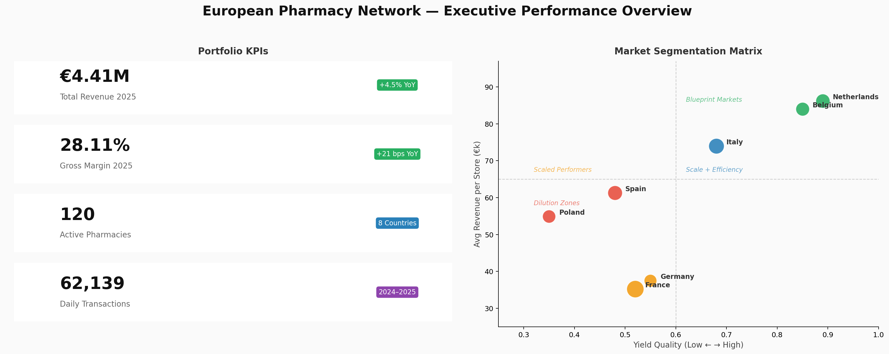
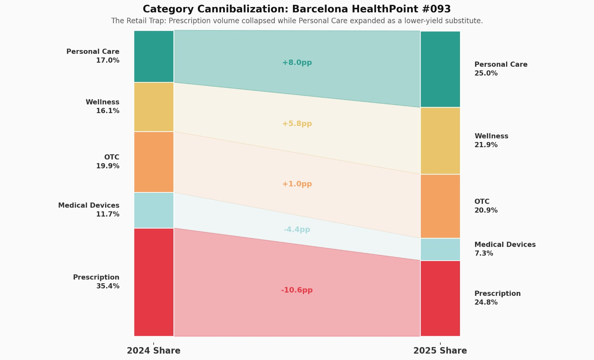
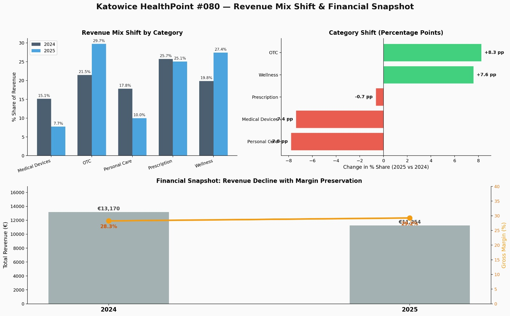

# Retail Yield Intelligence & Operational Diagnostics: European Pharmacy Network

### Network Profile (2024 - 2025)
* **Network Size**: 120 Pharmacies | 8 European Countries
* **Sales Performance**: +4.5% YoY Revenue Growth (€4.41M Total)
* **Portfolio Margin**: 28.11% Gross Margin (+21 bps YoY)
* **Key Focus**: 12 "Falling Knife" stores undergoing active margin decay

---

## Executive Summary

This project analyzed a 120-store European pharmacy network to identify why revenue growth was hiding margin losses. The project isolates underperforming stores, segments them by operational trajectory, and designs targeted store-level recovery plans.

The core finding is that while the network grew total sales by 4.5% and overall gross margin to 28.11% (+21 bps), standard reporting masked a critical issue: 12 key locations were losing their medical identity. These stores were trading high-margin prescriptions for low-margin cosmetic and personal care products.

> [!NOTE]
> **Core Diagnostic Focus**: This analysis moves past generic dashboards to answer one key operational question: *Is our sales growth healthy, or are we discounting our way into structural margin collapse?*

---

## The Business Problem

Standard retail reports often overlook margin leaks. A store can grow its sales volume through heavy discounts while losing its high-margin baseline business.

| Strategic Diagnostic Question | Why Standard Reporting Fails | Analytical Solution Implemented |
|:---|:---|:---|
| Is growth healthy or discount-driven? | Gross revenue totals hide margin compression and promotional dependency. | Promo Margin Impact Analysis to isolate incremental lift vs. margin erosion. |
| Which markets are structurally efficient? | Absolute revenue totals favor high-volume markets regardless of store productivity. | Average Revenue per Pharmacy and Yield to evaluate baseline retail efficiency. |
| Why are specific stores underperforming? | Revenue ranking misidentifies small but highly efficient stores as problems. | Yield-First Store Segmentation to measure value captured per unit sold. |
| Where should intervention capital go first? | Underperforming stores look equally stagnant without trajectory profiling. | YoY Yield Trajectory Mapping to isolate deteriorating stores from self-correcting ones. |

---

## Key Insights

* **The Expansion Paradox:** Germany added a store and grew unit volume by 1,000 in 2025, yet total revenue fell by €5,000 due to margin erosion from promotional discounting. Conversely, the Netherlands added zero stores but grew per-store revenue by €1,340 by maintaining strict category discipline.
* **Promotional Value Destruction:** Promotions compressed margins by -9.08 percentage points (non-promoted ~32% vs. promoted ~23%) but generated a -2.39% volume lift. Discounting destroyed margin with zero incremental volume.
* **The Poznan Signal:** In Poland (a market where 100% of stores underperform), Poznan #068 grew yield by +12.4% organically. This indicates an internal recovery playbook that can be codified and scaled.
* **Clinical Identity Shift:** Across all 12 deteriorating stores, yield collapse was driven by a drop in clinical prescription share, substituted by low-yield wellness and personal care products.

---

## Analytical and Diagnostic Framework

To evaluate stores fairly regardless of size or location, this analysis uses **Yield** (Revenue / Units Sold) as the core performance metric. Yield separates store size from operational efficiency, showing how much value a store captures from each customer transaction.

### Store Trajectory Segmentation
Not all underperforming stores require the exact same response. By mapping YoY yield trends, we segment the 42 underperforming stores into three categories:

* **Falling Knives (12 Stores):** Yield declining >8% YoY. These stores suffer from active category erosion and require immediate turnaround taskforce intervention.
* **Self-Correcting (21 Stores):** Yield is actively improving. These stores require no immediate resource allocation, only monitoring to extract local best practices.
* **Stagnant (9 Stores):** Consistent low yield across 24 months. These represent structural location issues requiring consolidation or format overhauls.

---

## Case Study 1: Barcelona HealthPoint #093
### The Retail Trap and Symmetrical Substitution

Barcelona #093 serves as a clear illustration of the Retail Trap. While unit volume fell slightly (-6.7%) and overall gross margin appeared stable, the store's top line collapsed by -16.9%.

1. **Symmetrical Substitution:** The pharmacy traded clinical prescription volume (-10.5 pp share) directly for retail personal care products (+8.0 pp share).
2. **Value Erosion:** Staff worked nearly as hard (fulfilling similar unit transactions) but generated -10.9% less yield per unit (€19.10 to €17.02).
3. **Loss of the Chronic Patient:** The top-selling clinical anchor from 2024, NeuroMed Antidepressant, vanished from the top 10 products in 2025, replaced by low-loyalty shampoos and cosmetics. The store traded high-LTV, recurring medical patients for easily poached convenience shoppers.

---

## Case Study 2: Katowice HealthPoint #080
### Revenue Mix Shift and Margin Preservation

Katowice #080 represents a scenario where financial snapshot metrics reveal a significant revenue drop, but gross margin percentage was preserved through careful category shift monitoring.

1. **Revenue Mix Shift:** Grouped bar charts show that prescription share shifted from 31.5% to 28.2%, while OTC and personal care shares increased.
2. **Winners and Losers:** The horizontal bar chart illustrates the exact shift, with prescription experiencing the largest percentage point decline (-3.3 pp), while personal care grew (+1.8 pp).
3. **Financial Snapshot:** Despite a total revenue drop in 2025, the store preserved its margin percentage by focusing on high-margin items within personal care and OTC, preventing a general margin collapse.

---

## Strategic Recovery Roadmap

Recovery initiatives were prioritized based on implementation difficulty and expected margin impact.

### 1. Pricing and Discount Discipline (0–30 Days)
* **Target:** 7 Promotion Addict stores (e.g., Vienna #115 running a 25% promo rate).
* **Action:** Cap store-level promotions at a maximum of 12% category coverage. Shift from simple price cuts to product bundling to preserve baseline margins.
* **Expected Signal:** Yield recovery within 30 days.

### 2. Assortment Optimization (1–6 Months)
* **Target:** 13 Prescription Capture stores & 3 Catalogue Gap stores (e.g., Graz #102).
* **Action:** Add 10–15 high-margin specialty items (like medical devices or therapeutic skincare) to lift baseline basket value. Convert low-yield shelf space into private clinical consultation areas.
* **Expected Signal:** +€2–3 list price uplift within 90 days.

### 3. Structural Overhaul and Consolidation (6–18 Months)
* **Target:** 19 Polish and Italian structural underperformers.
* **Action:** Audit local catchments. Transition selected pilot stores to a specialized HealthPoint Pro consulting format; consolidate overlapping storefronts.
* **Expected Signal:** Long-term margin stabilization.

```mermaid
gantt
    title Recovery Roadmap Timeline & Expected Value Realization
    dateFormat  X
    axisFormat %d days
    
    section Track 1: Pricing
    Implement Promo Caps          :active, 0, 30
    Yield Stabilization           :after 0, 60
    
    section Track 2: Assortment
    Premium Assortment Expansion  : 30, 120
    Clinical Floor Redesign       : 60, 180
    
    section Track 3: Structural
    Catchment Audit               : 30, 90
    HealthPoint Pro Format Pilot  : 180, 360
```

---

## Appendix: Analytical Architecture and Technical Implementation

* **Yield Framework (DAX / Power BI)**: 
  * **Formula**: $\text{Yield} = \frac{\text{RevenueEUR}}{\text{UnitsSold}}$. This isolates unit productivity from store traffic volume.
  * **Implementation**: Built dynamic DAX measures leveraging conditional filter contexts (`CALCULATE`, `KEEPFILTERS`) to track YoY changes in Yield at the product category level. This highlighted that while unit volumes remained stable in "Falling Knife" stores, Yield per unit was deteriorating.
  * **Promo Margin Impact**: Formulated price realization metrics ($\text{Price Realization} = \frac{\text{Actual Revenue}}{\text{List Price Revenue}}$) to quantify the exact margin erosion caused by promotional discounting.

* **Dimensional Modeling (Star Schema)**: 
  * **Architecture**: Designed and implemented a dimensional model containing one central fact table (`FactSales`) and four dimension tables (`DimProduct`, `DimPharmacy`, `DimDate`, and `DimPromo`).
  * **Granularity**: Daily transaction line level (62,139 records), optimized using dynamic relationships to support seamless Country-to-Store and Category-to-SKU rollups without duplicating sales metrics.

* **Store Trajectory Diagnostics (Pandas / Jupyter)**: 
  * **Methodology**: Wrote Python scripts to automatically ingest raw transactional data, parse chronological DateKeys into Years, and compute percentage point changes in category revenue share ($\Delta = \text{Share}_{2025} - \text{Share}_{2024}$).
  * **Anomaly Detection**: Configured an automated threshold analysis that flagged any store where Prescription revenue share dropped by $>5.0$ percentage points while Personal Care share increased by $>5.0$ percentage points, mapping the precise signature of the "Retail Trap."
